# Khanan Drishti

AI-enabled smart governance and compliance monitoring for Indian coal mines.

Khanan Drishti is designed to bridge the gap between field-level evidence and executive oversight. The platform connects safety inspections, statutory obligations, risk analysis, corrective actions, and management visibility into a unified digital dashboard.

---

## Overview

Managing compliance across multiple coal mining operations is a complex challenge. Traditional processes often rely on fragmented information, paper-based inspection reports, and isolated spreadsheets. This leads to delayed visibility into critical safety risks, difficulty in tracking open corrective actions, and a lack of correlation between field evidence and statutory regulations.

Khanan Drishti addresses this by providing a centralized, role-agnostic web platform. It transforms raw field observations into prioritized, actionable insights, ensuring that safety, environmental, and operational compliance are continuously monitored and enforced.

---

## Problem

Indian coal mines face significant governance challenges due to operational scale and rigorous safety regulations:
- **Fragmented Data**: Inspection reports, evidence, and compliance scores are siloed.
- **Delayed Escalations**: High-risk safety observations take too long to reach decision-makers.
- **Poor Contractor Visibility**: Tracking the safety compliance and CAPA (Corrective and Preventive Action) resolution of third-party contractors is difficult.
- **Disconnected Evidence**: Photos and field reports are rarely mapped directly to specific regulatory clauses.
- **Lack of Geospatial Risk Context**: It is difficult to visualize compliance and risk trends across different geographical regions and subsidiaries simultaneously.

---

## Solution

Khanan Drishti serves as a unified digital governance dashboard. While a complete system would encompass mobile field apps and complex backends, this repository focuses exclusively on the **Web Application Dashboard**. 

The conceptual workflow of the platform ensures total traceability:

`Field Evidence` → `Inspection` → `Verification` → `Obligation Mapping` → `Risk Analysis` → `CAPA` → `Governance Dashboard`

*Note: The current repository implements the frontend dashboard interface powered by extensive mock data to demonstrate the platform's capabilities without requiring a live backend.*

---

## Key Capabilities

| Capability | Description |
| :--- | :--- |
| **Command Center** | Centralized `(/dashboard)` view displaying aggregate metrics, compliance trends, and high-risk alerts across all subsidiaries. Features interactive data visualization using Recharts. |
| **Multi-Mine Monitoring** | Enterprise data table `(/mines)` allowing advanced filtering by subsidiary, risk level, mine type, and compliance status. |
| **Mine Profiles** | Detailed individual mine views `(/mines/:id)` containing specific KPIs, compliance data, and a visualized "Risk Explanation" chain for targeted safety issues. |
| **GIS Risk Map** | Interactive geospatial view `(/map)` using MapLibre GL JS. Plots mines across Indian regions, colored by risk severity, with a risk-ranked sidebar and detailed data popups. |
| **Search & Filtering** | Robust search and multi-parameter filtering implemented across the Mines list and GIS map. |
| **Design System** | Industrial, dark-themed UI built with React and Tailwind CSS, featuring reusable components (DataTables, Modals, Badges, Toast notifications) and responsive routing. |

*(Note: Routes such as CAPA, Inspections, Evidence, and Contractors are structurally scaffolded in the application shell with empty states, but their deep data-management interfaces are not fully implemented in the current frontend prototype.)*

---

## User Roles

The platform is designed to support different hierarchical views. The current dashboard implementation primarily reflects the **Corporate Management / Regulatory** perspective.

### Corporate Management & Regulatory Authorities
**Focus:** 
- Multi-mine visibility and geographical risk mapping.
- Aggregate compliance trends and subsidiary performance.
- Tracking major escalations and contractor governance.
- Statutory reporting oversight.

### Mine Officials (Conceptual)
**Focus:**
- Single-mine compliance status.
- Managing local inspections, observations, and evidence.
- Resolving assigned CAPAs.

---

## System Workflow

```mermaid
flowchart LR
    A[Field Evidence] --> B[Inspection]
    B --> C[AI Verification]
    C --> D[Obligation Mapping]
    D --> E[Risk Analysis]
    E --> F[CAPA Assignment]
    F --> G[Resolution Tracking]
    G --> H[Governance Dashboard]
    H --> I[Reporting & Analytics]
    
    style H fill:#1A2028,stroke:#F0A202,stroke-width:2px,color:#EDE6DA
```

*(The highlighted "Governance Dashboard" represents the core focus of this repository.)*

---

## Tech Stack

The web dashboard is a purely frontend implementation utilizing modern web technologies:
- **Core**: React 19, TypeScript, Vite
- **Styling**: Tailwind CSS (v4) with custom theme tokens
- **Routing**: React Router DOM (v7)
- **Mapping**: MapLibre GL JS
- **Charts**: Recharts
- **Icons**: Lucide React
